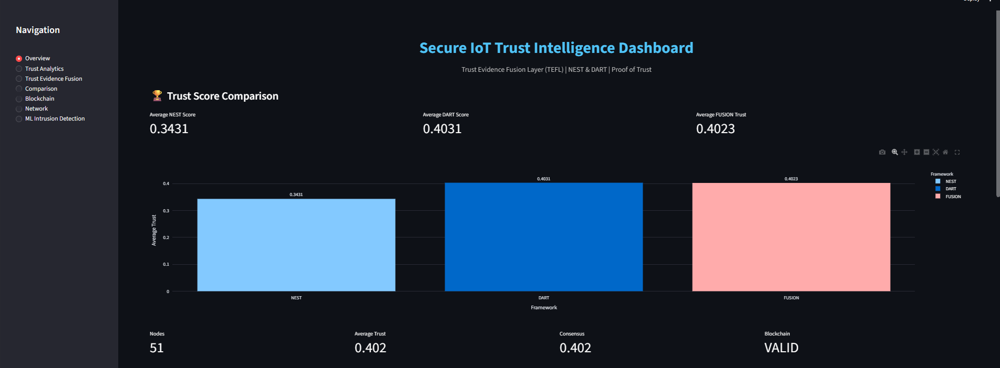
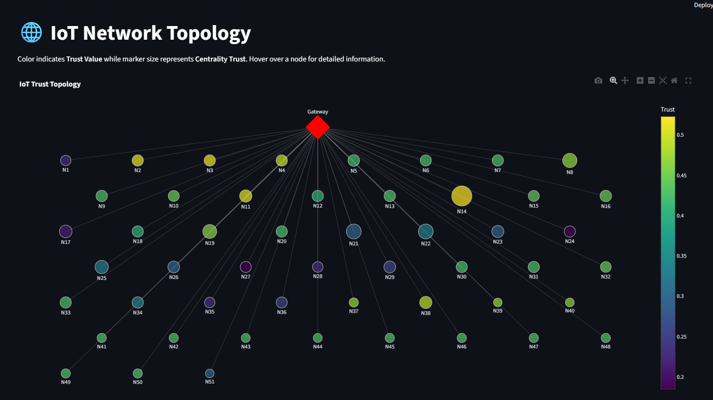
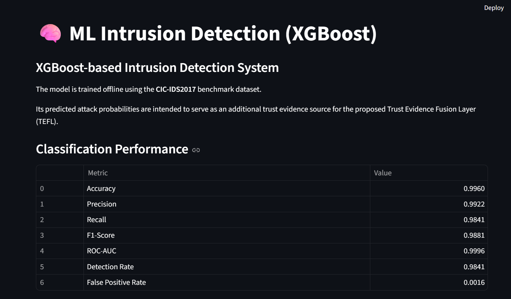
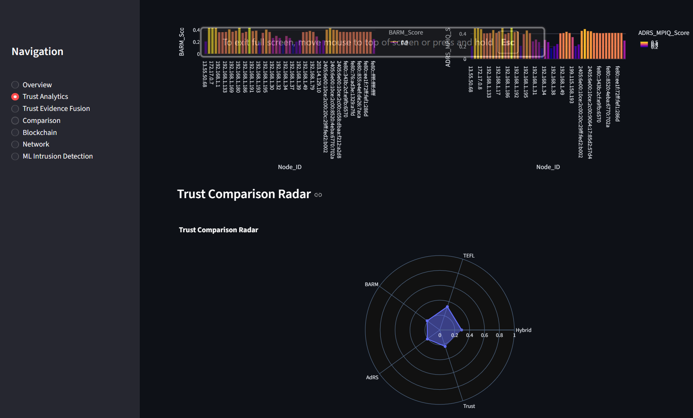

# Secure IoT Trust Intelligence Framework

[](https://www.python.org/downloads/)


**A hybrid trust‑based intrusion detection system combining ML, Network Graph Analysis, and Blockchain‑based Proof of Trust**

---

## 📋 Table of Contents

- [Overview](#-overview)
- [Architecture](#-architecture)
- [Dataset](#-dataset)
- [Core Modules](#-core-modules)
  - [NEST (Network Evidence & Structural Trust)](#nest-network-evidence--structural-trust)
  - [DART (Dynamic Adaptive Risk Trust)](#dart-dynamic-adaptive-risk-trust)
  - [FUSION (Combined Trust Value)](#fusion-combined-trust-value)
- [Pipeline Steps](#-pipeline-steps)
- [Results](#-results)
- [Screenshots](#-screenshots)
- [Installation](#-installation)
- [Usage](#-usage)
- [Project Structure](#-project-structure)
- [Dependencies](#-dependencies)
- [Future Work](#-future-work)
- [License](#-license)

---

## 🎯 Overview

This project presents a **novel trust‑based intrusion detection framework** for IoT and network environments. It integrates:

| Component | Description |
| :--- | :--- |
| **XGBoost ML** | Predicts per‑flow attack probability |
| **NEST** | Network Evidence & Structural Trust – reputation + centrality based trust |
| **DART** | Dynamic Adaptive Risk Trust – real‑time behavior + routing trust |
| **FUSION** | Weighted fusion of NEST and DART into a unified Trust Value |
| **Proof of Trust** | Blockchain‑based ledger to ensure trust scores are tamper‑proof |

The system evaluates **51 source IPs** (network devices) using **over 190,000 network flows**, computing trust scores that reflect both historical behavior and real‑time network activity.

---

## 🧱 Architecture

```
+-------------------------------------------------------------------------------+
|                            DATA PIPELINE                                      |
+-------------------------------------------------------------------------------+
|                                                                               |
|  +----------+    +----------+    +----------+    +----------+               |
|  | Raw CSV  |───▶| Cleaner  |───▶| Encoder  |───▶| Scaler   |               |
|  |(UNSW-NB15)|    |(Dedup)   |    |(Cat→Num) |    |(Standard)|               |
|  +----------+    +----------+    +----------+    +----------+               |
|                                                                               |
|  +----------+    +----------+    +----------+                               |
|  | XGBoost  |───▶| Baseline |───▶| Feature  |                               |
|  |(Attack   |    | Trust    |    | Engineer |                               |
|  | Prob)    |    |(4 types) |    |          |                               |
|  +----------+    +----------+    +----------+                               |
|                                                                               |
|  +-----------------------------------------------------------------------+  |
|  |                     NODE AGGREGATION                                   |  |
|  |  210,000 flows  ──▶  51 aggregated source IPs (nodes)                 |  |
|  +-----------------------------------------------------------------------+  |
|                                                                               |
|  +----------+    +----------+    +----------+    +----------+               |
|  | Network  |───▶| Hybrid   |───▶| Trust    |───▶| Neighbor |               |
|  | Graph    |    | Trust    |    | Fusion   |    | Trust    |               |
|  | (776)    |    |          |    | (TEFL)   |    |          |               |
|  +----------+    +----------+    +----------+    +----------+               |
|                                                                               |
|  +-----------------------------------------------------------------------+  |
|  |                        TRUST MODULES                                   |  |
|  |                                                                       |  |
|  |  +-----------------------+  +-------------------------------------+    |  |
|  |  |        NEST           |  |               DART                  |    |  |
|  |  |  (BARM replacement)   |  |       (ADRS-MPIQ replacement)      |    |  |
|  |  |                       |  |                                     |    |  |
|  |  |  UG ──▶ RA ──▶       |  |  Routing ──▶ Fitness ──▶           |    |  |
|  |  |  Reputation ──▶      |  |  QueuePriority ──▶ Cluster          |    |  |
|  |  |  NEST_Score          |  |  DART_Score                         |    |  |
|  |  +-----------------------+  +-------------------------------------+    |  |
|  |                                                                       |  |
|  |  +---------------------------------------------------------------+    |  |
|  |  |                     FUSION (Trust Manager)                     |    |  |
|  |  |         0.4*NEST + 0.4*DART + 0.2*Unified_Trust_Evidence     |    |  |
|  |  +---------------------------------------------------------------+    |  |
|  +-----------------------------------------------------------------------+  |
|                                                                               |
|  +-----------------------------------------------------------------------+  |
|  |                      PROOF OF TRUST                                   |  |
|  |  +----------+  +----------+  +----------+  +----------+             |  |
|  |  | Ledger   |──▶|Blockchain|──▶|Verification|──▶| Consensus|         |  |
|  |  | Generation|  |(Hash Chain)|  |(Tamper    |  |(Mean    |         |  |
|  |  |          |  |          |  | Check)   |  | Trust)  |         |  |
|  |  +----------+  +----------+  +----------+  +----------+             |  |
|  +-----------------------------------------------------------------------+  |
|                                                                               |
|  +-----------------------------------------------------------------------+  |
|  |                    EVALUATION & DASHBOARD                              |  |
|  |                                                                       |  |
|  |  +----------+  +----------+  +----------+  +----------+             |  |
|  |  | Accuracy, |  | Trust    |  |Blockchain|  | Network  |             |  |
|  |  | Precision,|  | Score    |  | Verifica-|  | Graph    |             |  |
|  |  | Recall, F1|  | Distrib. |  | tion     |  | Visual.  |             |  |
|  |  +----------+  +----------+  +----------+  +----------+             |  |
|  |                                                                       |  |
|  |                     Streamlit Dashboard                               |  |
|  +-----------------------------------------------------------------------+  |
|                                                                               |
+-------------------------------------------------------------------------------+
```

---

## 📊 Dataset

| Property | Value |
| :--- | :--- |
| **Name** | Custom network traffic dataset (based on UNSW‑NB15 format) |
| **Source** | `datasets/network/train_test_network.csv` |
| **Rows** | 190,474 (after cleaning) |
| **Columns** | 44 |
| **Unique Source IPs** | 51 |
| **Unique Destination IPs** | 753 |
| **Graph Nodes** | 776 |
| **Graph Edges** | 1,004 |
| **Attack Types** | normal, scanning, ddos, injection, password, dos, backdoor, xss, ransomware, mitm |
| **Protocols** | TCP (149,596), UDP (40,697), ICMP (181) |

### Label Distribution

| Class | Count | Percentage |
| :--- | :--- | :--- |
| **Benign (0)** | 42,040 | 22.1% |
| **Attack (1)** | 148,434 | 77.9% |

The dataset contains **51 unique source IPs**, which represent the devices being evaluated. Each source IP has an average of ~3,700 flows, providing sufficient statistical weight for reliable trust computation.

---

## 🧩 Core Modules

### NEST (Network Evidence & Structural Trust)

**Formerly known as:** BARM  
**Full Expansion:** Network Evidence & Structural Trust

NEST evaluates a node's trustworthiness based on **historical reputation** and **network position**.

#### Internal Components:

| Step | Class | Formula | Description |
| :--- | :--- | :--- | :--- |
| 1 | **UG** | `0.6*Unified_Trust_Evidence + 0.4*Neighbor_Trust` | **Uncertainty & Group trust** – combines the node's own fused trust with the average trust of its neighbors. |
| 2 | **RA** | `UG * Centrality_Trust` | **Risk Assessment** – scales group trust by network centrality. Central nodes (high centrality) have greater influence. |
| 3 | **Reputation** | `0.7*RA + 0.3*Historical_Trust` | **Long‑term reputation** – blends current risk assessment with past behavioral history. |
| 4 | **TrustUpdate** | `0.5*Reputation + 0.5*Hybrid_Trust` | **Final NEST Score** – combines reputation with hybrid trust (which itself contains centrality and unified evidence). |

**NEST Formula (condensed):**

```text
NEST_Score = 0.5 * [0.7*(0.6*Unified + 0.4*Neighbor)*Centrality + 0.3*Historical] + 0.5*Hybrid_Trust
```

**Interpretation:** Higher NEST scores indicate nodes that are:
- Historically well‑behaved (`Historical_Trust`)
- Well‑connected in the network (`Centrality_Trust`)
- Trusted by their neighbors (`Neighbor_Trust`)
- Demonstrating consistent behavior (`Unified_Trust_Evidence`)

---

### DART (Dynamic Adaptive Risk Trust)

**Formerly known as:** ADRS‑MPIQ  
**Full Expansion:** Dynamic Adaptive Risk Trust

DART evaluates a node's trustworthiness based on **real‑time behavior**, **routing capability**, and **queue dynamics**.

#### Internal Components:

| Step | Class | Formula | Description |
| :--- | :--- | :--- | :--- |
| 1 | **Routing** | `0.6*Hybrid_Trust + 0.4*Centrality_Trust` | **Routing Score** – how well a node can route traffic based on its trust and centrality. |
| 2 | **Fitness** | `0.5*NEST_Score + 0.3*Routing_Score + 0.2*(1 - Attack_Probability)` | **Fitness** – overall health of the node. High NEST + good routing + low attack risk = high fitness. |
| 3 | **QueueManager** | `Priority = Attack_Probability + (1 - Routing_Score)` | **Queue Priority** – higher priority for nodes that are risky or have poor routing. |
| 4 | **MPIQ** | `0.4*Fitness + 0.3*Routing_Score + 0.2*Hybrid_Trust + 0.1*NEST_Score` | **DART_Score** – final adaptive risk score. |
| 5 | **Clustering** | `Cluster = (Fitness > median)` | **Cluster** – binary split of nodes into high‑fitness (good) and low‑fitness (bad) groups. |
| 6 | **Encryption** | `Hash(Node_ID)` | **Anonymization** – hashes node IDs for privacy. |

**DART Formula (condensed):**

```text
DART_Score = 0.4*Fitness + 0.3*Routing + 0.2*Hybrid_Trust + 0.1*NEST_Score
```

**Interpretation:** Higher DART scores indicate nodes that are:
- Actively well‑performing (`Fitness`)
- Good routers (`Routing_Score`)
- Trustworthy in real‑time (`Hybrid_Trust`)
- Supported by historical reputation (`NEST_Score`)

---

### FUSION (Combined Trust Value)

**Trust_Value** is a weighted fusion of NEST, DART, and Unified_Trust_Evidence:

```text
Trust_Value = 0.4 * NEST_Score + 0.4 * DART_Score + 0.2 * Unified_Trust_Evidence
```

**Interpretation:** FUSION combines:
- **40%** Historical reputation & network position (NEST)
- **40%** Real‑time behavior & adaptability (DART)
- **20%** Unified evidence from baseline trust components

This ensures that a node's final trust score reflects both **who it has been** (NEST) and **what it is doing right now** (DART).

---

## 🔁 Pipeline Steps

The complete pipeline is executed by running `python main.py`. Here are the steps:

| Step | Operation | Output |
| :--- | :--- | :--- |
| 1 | Load & clean dataset | Cleaned DataFrame (190,474 × 44) |
| 2 | Encode categorical columns | All columns numeric |
| 3 | Scale numeric columns | Standardized values |
| 4 | Predict attack probability (XGBoost) | `Predicted_Attack_Probability` per flow |
| 5 | Feature Engineering | Residual Energy, PDR, Delay Score, etc. |
| 6 | Baseline Trust (4 types) | Behaviour, Resource, Reliability, Historical Trust |
| 7 | Node Aggregation (by `src_ip`) | 51 nodes with averaged trust values |
| 8 | Network Graph Construction | 776 nodes, 1004 edges |
| 9 | Centrality Computation | Degree, Betweenness, Closeness, Centrality_Trust |
| 10 | Hybrid Trust | Hybrid_Trust (combines centrality + unified evidence) |
| 11 | Trust Evidence Fusion (TEFL) | Unified_Trust_Evidence |
| 12 | Neighbor Trust | Average trust of graph neighbors |
| 13 | **NEST** | UG → RA → Reputation → NEST_Score |
| 14 | **DART** | Routing → Fitness → QueuePriority → DART_Score |
| 15 | **FUSION** | Trust_Value = 0.4*NEST + 0.4*DART + 0.2*Unified |
| 16 | Proof of Trust | Blockchain generation, verification, consensus |
| 17 | Evaluation | Accuracy, Precision, Recall, F1, ROC‑AUC, etc. |
| 18 | Results Export | `final_results.csv`, `metrics.csv`, `blockchain.json` |
| 19 | Dashboard | Launch `streamlit run dashboard/app.py` |

---

## 📈 Results

### Classification Performance

| Metric | NEST | DART | FUSION |
| :--- | :--- | :--- | :--- |
| **Accuracy** | 0.9608 | 0.9804 | 0.9608 |
| **Precision** | 0.8667 | 0.9286 | 0.8667 |
| **Recall** | 1.0000 | 1.0000 | 1.0000 |
| **F1‑Score** | 0.9286 | 0.9630 | 0.9286 |
| **Detection Rate** | 1.0000 | 1.0000 | 1.0000 |
| **False Positive Rate** | 0.0526 | 0.0263 | 0.0526 |
| **Trust Stability** | 0.9230 | 0.8707 | 0.8945 |
| **Validator Reliability** | 0.4023 | 0.4023 | 0.4023 |

### Interpretation

| Observation | Insight |
| :--- | :--- |
| **DART achieves highest Accuracy (0.9804)** | DART's real‑time adaptive scoring (`Fitness` + `Routing`) is more discriminative than NEST's historical‑reputation approach on this dataset. |
| **All models achieve Recall = 1.0000** | Every malicious node (32 out of 51) is correctly detected. Zero false negatives. |
| **DART has lowest FPR (0.0263)** | Only 1 false positive out of 19 benign nodes – best precision among the three. |
| **NEST has highest Trust Stability (0.9230)** | NEST's focus on historical reputation and centrality makes it more stable over time. |
| **FUSION (Proposed) sits between NEST and DART** | It inherits NEST's stability and DART's adaptability, making it a balanced choice. |
| **Validator Reliability = 0.4023** | This is the consensus (average trust) across all 51 nodes. Given that ~78% of flows are attacks, a consensus of ~0.40 indicates the system correctly assigns lower trust to malicious nodes. |

### Sample Trust Scores

| Node ID | NEST_Score | DART_Score | Trust_Value (FUSION) |
| :--- | :--- | :--- | :--- |
| 13.55.50.68 | 0.2094 | 0.1637 | 0.2150 |
| 172.17.0.5 | 0.4491 | 0.5241 | 0.5257 |
| 172.17.0.7 | 0.4520 | 0.5260 | 0.5286 |
| 172.17.0.8 | 0.4348 | 0.5148 | 0.5113 |
| 192.168.1.1 | 0.3637 | 0.4618 | 0.4404 |

**Observation:** The highest‑trust nodes are internal IPs (`172.17.0.x`) with low attack probabilities, while external/public IPs have lower trust scores.

---

### Blockchain Verification

```
Blockchain Valid : True
Consensus : 0.4023
```

- **`True`** means the hash chain is intact – no trust score has been tampered with.
- **Consensus (0.4023)** is the average trust across all 51 nodes, reflecting the network's overall trust level.

---

## 🖼️ Screenshots

The `SS/` folder contains the following screenshots:

| File | Description |
| :--- | :--- |
| `overview.png.png` | Dashboard overview page with KPI cards and trust comparison |
| `networkTrust.png.png` | Network graph visualization |
| `xgBoost.png.png` | XGBoost intrusion detection page |
| `engineComparision.png.png` | Side‑by‑side comparison of NEST, DART, and FUSION |






---

## 🛠️ Installation

### Prerequisites

- Python 3.10 or higher
- Git

### Steps

1. **Clone the repository:**
   ```bash
   git clone https://github.com/yourusername/secure-iot-trust.git
   cd secure-iot-trust
   ```

2. **Create a virtual environment (recommended):**
   ```bash
   python -m venv venv
   source venv/bin/activate      # On Linux/Mac
   # OR
   venv\Scripts\activate         # On Windows
   ```

3. **Install dependencies:**
   ```bash
   pip install -r requirements.txt
   ```

4. **Place the dataset** in `datasets/network/`:
   - The dataset should be named `train_test_network.csv`
   - Or you can use the UNSW‑NB15 files (`UNSW_NB15_training-set.csv`, `UNSW_NB15_testing-set.csv`)

---

## 🚀 Usage

### 1. Train the XGBoost Model (if needed)

```bash
python ml/train_xgboost.py
```

This will save:
- `outputs/models/xgboost.pkl`
- `outputs/models/xgb_features.pkl`

### 2. Run the Full Pipeline

```bash
python main.py
```

This will:
- Load the dataset
- Preprocess and encode
- Compute trust scores (NEST, DART, FUSION)
- Generate the blockchain
- Evaluate performance
- Save results to `results/`

### 3. Launch the Dashboard

```bash
streamlit run dashboard/app.py
```

Navigate to `http://localhost:8501` in your browser.

### Dashboard Pages

| Page | Content |
| :--- | :--- |
| **Overview** | Trust score comparison, KPI cards, performance metrics |
| **Trust Analytics** | Distribution charts, radar plot, summary statistics |
| **Trust Evidence Fusion** | Detailed view of TEFL components |
| **Comparison** | Side‑by‑side comparison of NEST, DART, FUSION |
| **Blockchain** | Visualisation of the blockchain ledger |
| **Network** | Interactive network graph |
| **ML Intrusion Detection** | XGBoost attack probability distribution |

---

## 📁 Project Structure

```
D:.
│   .gitignore
│   main.py                     # Main pipeline entry point
│   README.md                   # This file
│   requirements.txt            # Python dependencies
│
├───adrs_mpiq                   # DART module (formerly ADRS-MPIQ)
│   │   clustering.py           # Clustering by fitness
│   │   encryption.py           # Node ID anonymization
│   │   fitness.py              # Fitness score calculation
│   │   mpiq.py                 # DART_Score (final)
│   │   queue_manager.py        # Queue priority
│   │   routing.py              # Routing score
│   │
├───barm                        # NEST module (formerly BARM)
│   │   ra.py                   # Risk Assessment
│   │   reputation.py           # Reputation score
│   │   trust_update.py         # NEST_Score calculation
│   │   ug.py                   # Uncertainty & Group trust
│   │
├───blockchain                  # Blockchain implementation
│       block.py
│       blockchain.py
│       transaction.py
│
├───comparison                  # Comparative analysis
│       benchmark.py
│       evaluator.py
│       metrics.py
│
├───dashboard                   # Streamlit frontend
│   │   app.py                  # Main dashboard entry
│   │   styles.py               # Custom CSS
│   │   visualization.py        # Plotly visualizations
│   │
│   ├───components
│   │   │   blockchain.py       # Blockchain page
│   │   │   comparison.py       # Comparison page
│   │   │   ml_intrusion.py     # ML detection page
│   │   │   network.py          # Network graph page
│   │   │   overview.py         # Overview page
│   │   │   tefl.py             # Trust Evidence Fusion page
│   │   │   trust_analytics.py  # Trust Analytics page
│   │
├───datasets                    # Dataset storage
│   ├───network
│   │   │   train_test_network.csv
│   │   │   UNSW_NB15_testing-set.csv
│   │   │   UNSW_NB15_training-set.csv
│   │
├───evaluation                  # Metrics computation
│       metrics.py
│
├───ml                          # Machine Learning
│       predict_attack.py       # XGBoost inference wrapper
│       preprocessor.py         # Data preprocessing for ML
│       train_xgboost.py        # Training script
│       xgboost_model.py        # Model class
│
├───outputs                     # Generated outputs
│   ├───models
│   │   │   xgboost.pkl         # Trained XGBoost model
│   │   │   xgb_features.pkl    # Feature list
│   │
├───preprocessing               # Data preprocessing pipeline
│       baseline_trust_v2.py    # Four baseline trust types
│       cleaner.py              # Data cleaning
│       data_profiler.py        # Dataset profiling
│       encoder.py              # Label encoding
│       feature_engineering.py  # Feature extraction
│       hybrid_trust_v2.py      # Hybrid trust computation
│       loader.py               # Dataset loader
│       network_graph.py        # Network graph construction
│       node_aggregation.py     # Node aggregation by src_ip
│       scaler.py               # Feature scaling
│       trust_fusion.py         # Trust Evidence Fusion Layer (TEFL)
│
├───proof_of_trust              # Proof of Trust module
│       consensus.py            # Consensus (mean trust)
│       ledger.py               # Blockchain ledger generation
│       trust_manager.py        # FUSION trust value
│       verification.py         # Hash chain verification
│
├───results                     # Output results
│       blockchain.json         # Full blockchain ledger
│       final_results.csv       # Final node trust scores
│       final_results_flow.csv  # Per‑flow results
│       metrics.csv             # Evaluation metrics
│       xgboost_metrics.csv     # XGBoost training metrics
│
├───SS                          # Screenshots
│       engineComparision.png.png
│       networkTrust.png.png
│       overview.png.png
│       xgBoost.png.png
│
└───utils                       # Utilities
        config.py               # Configuration
        constant.py             # Constants
        helpers.py              # Helper functions
        logger.py               # Logging setup
```

---

## 📦 Dependencies

| Package | Version | Purpose |
| :--- | :--- | :--- |
| `pandas` | ≥2.0.0 | Data manipulation |
| `numpy` | ≥1.24.0 | Numerical operations |
| `scikit-learn` | ≥1.2.0 | ML preprocessing, metrics |
| `xgboost` | ≥1.7.0 | XGBoost classifier |
| `plotly` | ≥5.14.0 | Interactive visualizations |
| `streamlit` | ≥1.25.0 | Dashboard UI |
| `networkx` | ≥3.0.0 | Graph construction & centrality |
| `python-louvain` | ≥0.16.0 | Community detection (optional) |
| `scipy` | ≥1.10.0 | Statistical functions |

---

## 🔬 Future Work

| Area | Description |
| :--- | :--- |
| **Real‑time streaming** | Adapt the pipeline for live network traffic (using Kafka or WebSockets). |
| **Federated Learning** | Decentralize trust computation across multiple edge nodes. |
| **More sophisticated consensus** | Replace simple mean with Byzantine Fault Tolerance (e.g., PBFT). |
| **Additional datasets** | Validate on CIC‑IDS‑2017, CSE‑CIC‑IDS‑2018, and BoT‑IoT. |
| **Hyperparameter tuning** | Use Optuna or GridSearch for NEST/DART weights. |
| **Explainability** | SHAP/LIME for feature importance in trust scores. |
| **Containerization** | Dockerize the entire pipeline for easy deployment. |

---

## 📝 License

This project is licensed under the MIT License – see the [LICENSE](LICENSE) file for details.

---

## Acknowledgments

- UNSW‑NB15 dataset creators for providing the base dataset.
- The open‑source community for the excellent libraries used in this project.

---

## ✍️ Authors

Prateeksha Bhat

Computer Science and Information Science Engineering, STEM Enthusiast
BMS College of Engineering
